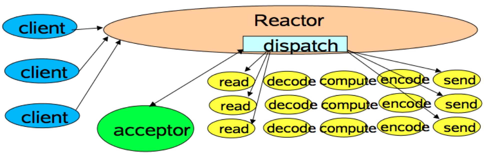
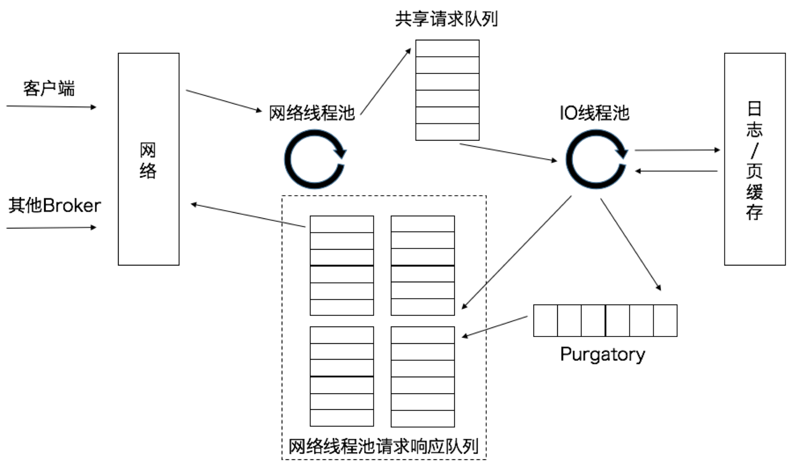
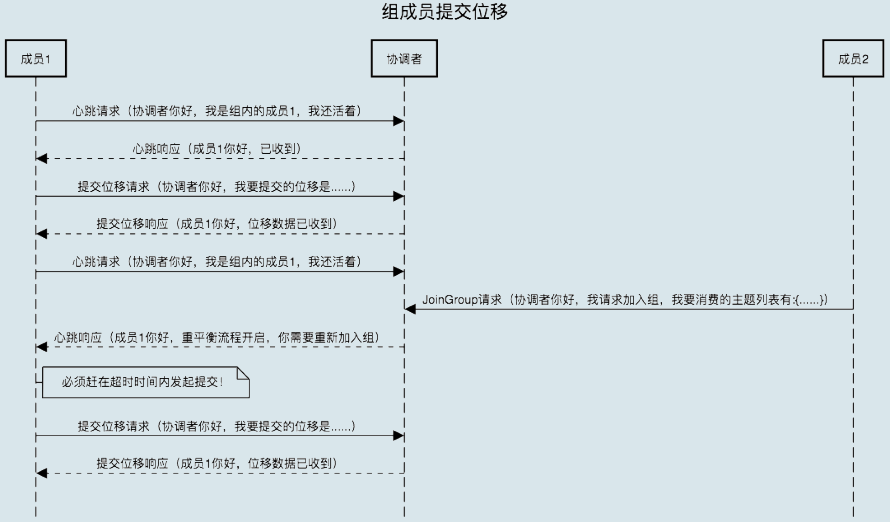

## 1.Kafka入门

### 1.1 消息引擎系统ABC

**消息引擎系统**：系统A发送消息给消息引擎系统，系统B从消息引擎系统中读取A发送是消息。

- 传输消息的格式：纯二进制的字节序列，消息还是结构化的，只是在使用之前都要将其转换成二进制的字节序列。
- 传输协议
  - 点对点模型：系统A发送的消息只能被系统B接收，其它任何系统都不能读取A发送的消息。
  - 发布/订阅模型：发送方称为发布者(Publisher)，接收方称为订阅者(Subscriber)，这个模型可能存在多个发布者向相同的主题(Topic)发送消息，而订阅者也可能存在多个，它们都能接收到相同主题的消息。

**填谷削峰**

引入Kafka后，上游订单服务不在直接与服务进行交互。当新订单生成后它仅仅是向Kafka Broker发送一条订单消息即可。下游的各个子服务订阅Kafka中的对应主题，并实时从该主题的各自分区(Partition)中获取到订单消息进行处理，从而实现了上游订单服务与下游订单处理服务的解耦。当出现秒杀业务时，Kafka能够将瞬时增加的订单流量全部以消息形式保存在对应的主题中，既不影响上游服务的TPS，同时也给下游子服务留出了充足的时间去消费它们。

### 1.2 Kafka术语

**生产者(Producer)**和**消费者(Consumer)**统称为**客户端(Clients)**，Kafka的服务器端由被称为**Broker**的服务进程构成，即一个Kafka集群由多个Broker组成，Broker负责接收和处理客户端发送过来的请求。以及对消息进行持久化。(Borker分散运行在不同的机器上)。

相同的数据拷贝到多台机器上，这些相同的数据拷贝在Kafka中称为**副本(Replica)**。**领导者副本(Leader Replica)**：对外提供副本(与客户端程序进行交互)；**追随者副本(Follower Replica)**：被动的追随领导者副本，不能与外界进行交互。**副本的工作机制**：生产者总是向领导者副本写消息，而消费者总是从领导者副本读消息，追随者副本，只做一件事：向领导者副本发送请求，请求领导者把最新生成的消息发给它(保持与领导者同步)。

Kafka中的分区机制指的是将每个主题划分成多个**分区(Partition)**，每个分区是一组有序的消息日志。生产者生产的每条消息**只会被发送到一个分区中**。副本是在分区这个层级定义的，每个分区下可以配置若干个副本，其中只能有1个领导者副本和N-1个追随者副本。生产者向分区写入消息，每条消息在分区中的位置信息由一个叫**位移(Offset)**的数据来表征，分区位移总是从0开始。

**Kafka的三层消息架构**

- 主题层：每个主题可以配置M个分区，而每个分区又可以配置N个副本。
- 分区层：每个分区的N个副本只能有一个充当领导者角色，对外提供服务；其它N-1个副本是追随者副本，只是提供数据冗余之用。
- 消息层：分区中包含若干条消息，每条消息的位移从0开始，依次递增。

客户端程序只能与分区的领导者副本进行交互。

**持久化数据**

Kafka使用消息日志(Log)来保存数据，一个日志就是磁盘上一个只能追加写(Append-only)消息的物理文件(只能追加，避免了缓慢的随机I/O操作，改为性能较好的顺序I/O写操作)。Kafka会定期的删除消息以回收磁盘，**日志段(Log Segment)机制**：一个日志近一步细分成多个日志段，并将老的日志段封存起来，后台定时任务会定期的检查老的日志段是否能够被删除，从而实现回收磁盘空间的目的。

**消费者组(Consumer Group)**，指的是多个消费者实例共同组成一个组来消费一组主题。这组主题中的每个分区都都只会被组内的一个消费者实例消费，其它消费者实例不能消费它。多个消费者实例同时消费，加速整个消费端的吞吐量(TPS)。

**重平衡(Rebalance)**：组内某个实例挂掉了，Kafka能够自动检测到，然后把这个Failed实例之前负责的分区转移给其它活着的消费者。

**消费者位移(Consumer Offser)**：记录了消费者在消费消息过程中消费到了分区的哪个位置上。上面的"位移"表征的是分区内的消息位置，它是不变的，即一旦消息被成功写到到一个分区上，它的位移值就是固定的了。而消费者位移则不同，它可能是随时变化的，是消费者消费进度的指示器，另外每个消费者有着自己的消费者位移。

**总结**

- 消息：Record，Kafka处理的主要对象。
- 主题：Topic，主题是承载消息的逻辑容器，在实际使用中多用来区分具体的业务。
- 分区：Partition，一个有序不变的消息序列，每个主题下可以有多个分区。
- 消息位移：Offset，表示分区中每条消息的位置信息，是一个单调递增且不变的值。
- 副本：Replica，Kafka中同一条消息能够被拷贝多个地方以提供数据冗余，这些地方就是所谓的副本。副本还分为领导者副本和追随者副本。副本是在分区层级下的，即每个分区可配置多个副本实现高可用。
- 生产者：Producer，向主题发布新消息的应用程序。
- 消费者：Consumer，从主题订阅新消息的应用程序。
- 消费者位移：Consumer Offset，表征消费者消费进度，每个消费者都有自己的消费者位移。
- 消费者组：Consumer Group，多个消费者实例共同组成一个组，同时消费多个分区以实现高吞吐。
- 重平衡：Rebalance，消费组内某个消费者实例挂掉后，其它消费者实例自动重新分配订阅主题分区的过程，是Kafka消费者端实现高可用的重要手段。


### 1.3 Kafka只是消息引擎系统吗？

Kafka是消息引擎系统，也是一个分布式流处理平台。

- 提供一套API实现生产者和消费者；
- 降低网络传输和磁盘存储开销；
- 实现高伸缩性架构。

## 2.Kafka的基本使用

### 2.1 Kafka线上集群部署方案怎么做？

**操作系统**

Linux更加适合Kafka

- I/O模型的使用：阻塞式I/O、非阻塞式I/O、I/O多路复用、信号驱动I/O、异步I/O，Kafka客户端使用了Java的selector，selector在Linux上的实现机制是epoll。
- 数据网络传输效率：零拷贝
- 社区支持度

**磁盘**

Kafka使用方式多是顺序读写，规避了机械硬盘随机读写操作慢的缺点。

磁盘阵列：提供冗余的磁盘存储空间；提供负载均衡。Kafka自己实现了冗余机制提供高可靠性，通过分区实现负载均衡。

**磁盘容量**

每天1亿条1KB大小的消息，保存两份且留存两周：1亿 * 1KB * 2 /1000/1000 = 200GB，其它数据(如索引数据)，预留10%，220GB * 14 = 3TB，假设数据压缩比0.75，0.75 * 3 = 2.25TB

- 新增消息数
- 消息留存时间
- 平均消息大小
- 备份数
- 是否启用压缩

**带宽**

带宽1Gbps(千兆网)，1小时内处理1TB的业务数据(1024 * 1024 / 3600 * 8每秒需要处理2336Mb的数据)，假设每台Kafka机器没有混布其他服务，Kafka用到70%的带宽资源，通常再额外留出2/3的资源，即单台服务器使用带宽1000 * 70% / 3 = 240Mbps。2336/240 = 10，如果消息还需要额外复制两份，那么服务器台数还需要x3，即30台。


### 2.2 重要的集群参数配置

**Broker端参数**

- log.dirs：Broker需要使用的若干个文件目录路径(无默认值)

  配置多个路径，CSV格式(即用逗号分隔的多个路径，如`/home/kafka1,/home/kafka2,/home/kafka3`)，这些目录挂载到不同的物理磁盘上更好：

  - 提升读写性能：比起单块磁盘，多块物理磁盘同时读写数据有更高的吞吐量。
  - 能实现故障转移：即Failover，1.1之前Kafka Broker使用的任何一块磁盘挂掉了，整个Broker进程都会被关闭，1.1之后坏掉的磁盘上的数据会自动的转移到其它正常的磁盘上。

- log.dir：只能表示单个路径，用来补充上一个参数。

ZooKeeper是一个分布式协调框架，负责协调管理并保存Kafka集群的所有元数据信息，比如集群都有哪些Broker在运行，创建了哪些Topic，每个Topic都有多少分区以及这些分区的Leader副本都在哪些机器上等信息。

- zookeeper.connect：也是一个CSV格式的参数，如`zk1:2181,zk2:2181,zk3:2181`。2181 是 ZooKeeper 的默认端口。假如有两套Kafka集群(kafka1和kafka2)，通过chroot(别名)，参数可以指定为`zk1:2181,zk2:2181,zk3:2181/kafka1`和`zk1:2181,zk2:2181,zk3:2181/kafka2`。

客户端程序或其他Broker如何与该Broker进行通信的设置

- listeners：监听器，告诉外部连接者要通过什么协议访问指定主机名和端口开放的Kafka1服务

  若干个逗号分隔的三元组，每个三元组格式为`<协议名称，主机名，端口号>`。协议名称可能是标准的名字，如PLAINTEXT(明文传输)、SSL(使用SSL或TLS加密传输)等；也可能是自定义的协议名字如`CONTROLLER：//localhost:9092`。

  一旦自定义了协议名称，还必须指定listener.security.protocol.map告诉这个协议底层使用里哪种安全协议，比如指定`listener.security.protocol.map=CONTROLLER:PLAINTEXT表示CONTROLLER`这个自定义协议底层使用明文不加密传输数据。

  **Broker端和Client端应用配置中应全部填写主机名。**

- advertised.listeners：Advertised：宣称的、公布的，即这组Broker用于对外发布的。

关于Topic管理

- auto.create.topics.enable：是否允许自动创建Topic，建议设置为false。
- unclean.leader.election.enable：是否允许Unclean Leader选举，建议false。true：允许从"落后"的副本里选择Leader(可能会丢失数据)；false：不允许"落后"太多的副本竞选Leader，分区不可用。
- auto.leader.rebalance.enable：是否允许Kafka定期进行Leader重选举，建议false。

数据保留方面

- log.retention.{hour|minutes|ms}：控制一条消息被保存多久，优先级：ms>minutes>hour。log.retention.hour：168，表示保存7天的数据，自动删除7天前的数据。
- log.retention.bytes：指定Broker为消息保存的总磁盘容量大小，默认-1(不限制)。多租户Kafka集群时用处比较大。
- message.max.bytes：控制Broker能够接收的最大消息大小，默认1000012(不到1MB)，建议调大(仅仅衡量Broker能够处理的最大消息大小，即使设置大也不会耗费磁盘空间)。

**Topic级别参数**

Topic级别参数会覆盖Broker参数的值，每个 Topic 都能设置自己的参数值。

- retention.ms：规定了该Topic消息被保存的时长，默认7天。
- retention.bytes：规定了为该Topic预留多大的磁盘空间，默认值-1。
- max.message.bytes：Kafka Broker能够正常接收该Topic最大消息大小。

怎么设置Topic级别的参数

1. 创建Topic时进行设置

   需要将交易数据发送到Kafka进行处理，需要保存近半年的交易数据，同时数据很多(不超过5MB)，创建Topic：`--config`后面指定想要设置的Topic级别参数

   ```sh
   bin/kafka-topics.sh--bootstrap-serverlocalhost:9092--create--topictransaction--partitions1--replication-factor1--config retention.ms=15552000000--configmax.message.bytes=5242880
   ```
   
2. **修改Topic时设置**

   修改发送消息最大值10MB

   ```sh
   bin/kafka-configs.sh--zookeeperlocalhost:2181--entity-typetopics--entity-nametransaction--alter--add-config max.message.bytes=10485760
   ```

**JVM参数**

- KAFKA_HEAP_OPTS：指定堆大小，默认1GB，建议设为6GB，Kafka Broker与客户端进行交互时会在JVM堆上创建大量的ByteBuffer。
- KAFKA_JVM_PERFORMANCE_OPTS：指定 GC 参数，Java8使用默认的G1即可。

启动Kafka Broker之前，设置这两个环境变量：

```sh
$> export KAFKA_HEAP_OPTS=--Xms6g  --Xmx6g
$> export  KAFKA_JVM_PERFORMANCE_OPTS= -server -XX:+UseG1GC -XX:MaxGCPauseMillis=20 -XX:InitiatingHeapOccupancyPercent=35 -XX:+ExplicitGCInvokesConcurrent -Djava.awt.headless=true
$> bin/kafka-server-start.sh config/server.properties
```

**操作系统参数**

- 文件描述符限制：ulimit -n 1000000
- 文件系统类型：XFS
- Swappiness：swap调优，设为0时，当物理内存耗尽时，就会触发OOM killer，随机挑选一个组件kill掉，不会给用户任何预警。使用swap空间，至少可以观测到Broker性能急剧下降，从而进一步调优和诊断问题。建议将Swappiness配置成一个解决0但不为0的值，如1。
- 提交时间(Flush落盘时间)：向Kafka发送数据，数据被写入到操作系统的页缓存(Page Cache)上就认为成功了，随后操作系统会根据LRU算法会定期将页缓存上的"脏"数据落盘到物理磁盘上，这个"定期"就是由提交时间来确定的，默认5秒，可以适当增加提交间隔来降低物理磁盘的写操作。(页缓存数据在写入到磁盘前宕机，数据丢失：Kafka在软件层面已经提供了多副本的冗余机制)

## 3.客户端实践与原理刨析

### 3.1 生产者消息分区机制原理刨析

**为什么分区？**

Kafka消息组织：主题-分区-消息。主题下的每条消息只会保存在某一个分区中，不会在多个分区中被保存多份。


分区的作用是提供负载均衡的能力，为了实现系统的高伸缩性。不同的分区能够被放置到不同节点的机器上，而数据的读写操作也是针对分区这个粒度进行的，这样每个节点的机器都能独立的执行各自分区的读写请求处理，并且，还可以通过添加新的节点机器来增加整体系统的吞吐量。

**分区策略**

决定生产者将消息发送到哪个分区的算法

- 自定义分区策略

  配置生产者端的参数`partitioner.class`，编写一个具体的类实现`org.apache.kafka.clients.producer.Partitioner`接口，重写partition方法：

  ```java
  int partition(String topic, Object key, byte[] keyBytes, Object value, byte[] valueBytes, Cluster cluster);
  ```

  `topic、key、keyBytes、value`和`valueBytes`都属于消息数据，`cluste`r则是集群信息(比如当前Kafka集群共有多少主题，多少Broker等)。

- 轮询策略(Round-robin)

  顺序分配，如一个主题下有3个分区，那么第一条消息被发送到分区0，第二条被发送到分区1，第三条被发送到分区2，以此类推。当生产第 4 条消息时又会重新开始，即将其分配到分区0。

  

  Kafka Java生产者默认提供的分区策略，有着非常优秀的负载均衡表现，它总是能保证消息最大限度的被平均分配到所有分区上。

- 随机策略(Randomness)

  随机的将消息放置到任意一个分区上，力求将数据均匀的打散到各个分区，但实际表现上要略逊于轮询策略，新版本中被轮询策略取代。

  

  实现随机策略版的partition方法

  ```java
      @Override
      public int partition(String topic, Object key, byte[] keyBytes, Object value, byte[] valueBytes, Cluster cluster) {
          List<PartitionInfo> partitions = cluster.partitionsForTopic(topic);
          return ThreadLocalRandom.current().nextInt(partitions.size());
      }
  ```

  先计算出该主题总的分区数，然后随机返回一个小于它的正整数。

- 按消息键保序策略(Key-ordering)

  一旦消息被定义了Key，那么就可以保证同一个Key的所有消息都进入到相同的分区，由于每个分区下的消息处理都是有序的，故这个策略被称为按消息键保序策略。

  

  实现按消息键保序策略版的partition方法

  ```java
      @Override
      public int partition(String topic, Object key, byte[] keyBytes, Object value, byte[] valueBytes, Cluster cluster) {
          List<PartitionInfo> partitions = cluster.partitionsForTopic(topic);
          return Math.abs(key.hashCode())%partitions.size();
      }
  ```

  Kafka默认分区策略实际上同时实现了两种策略：如果指定了Key，那么默认实现按消息键保序策略，否则使用轮询策略。

- 其他分区策略

  - 基于地理位置的分区策略(针对跨城市、国家的大规模Kafka集群)

    从所有分区中找出Leader副本在南方的所有分区，然后随机挑选一个进行消息发送。

    ```java
     @Override
        public int partition(String topic, Object key, byte[] keyBytes, Object value, byte[] valueBytes, Cluster cluster) {
            List<PartitionInfo> partitions = cluster.partitionsForTopic(topic);
            return partitions.stream().filter(p -> isSouth(p.leader().host())).map(PartitionInfo::partition).findAny().get();
        }
    ```


### 3.2 生产者压缩算法

压缩(compression)，用时间去换空间，即用CPU时间去换磁盘空间或网络I/O传输量，希望以较小的CPU开销带来更少的磁盘占用或更少的网络I/O传输。

**怎么压缩？**

Kafka的消息层次分为两层：消息集合(message set)及消息(message)。一个消息集合中包含若干条日志项(record item)，而日志项才是真正封装消息的地方。Kafka底层的消息日志由一系列消息集合日志组成。Kafka通常不会直接操作具体的一条条消息，它总是在消息集合这个层面上进行写入操作。

引入V2版本：

1. 把消息的公共部分抽取出来放到外层消息集合里，不用每条消息都保存这些信息了。
2. 对整个消息集合进行压缩。

**何时压缩？**

Kafka中，压缩可能发生在两个地方：生产者端和Broker端。

生产者程序中配置compression.type参数即表示启用指定类型的压缩算法。

如何构建一个开启GZIP的Producer对象：

```java
        Properties properties = new Properties();
        properties.put("bootstrap.servers","127.0.0.1:9092");
        properties.put("acks","all");
        properties.put("key.serializer","org.apache.kafka.common.serialization.StringSerializer");
        properties.put("value.serializer","org.apache.kafka.common.serialization.StringSerializer");
        // 开启GZIP压缩
        properties.put("compression.type","gzip");

        Producer<String,String> producer = new KafkaProducer<String, String>(properties);
```

` properties.put("compression.type","gzip")`表明该Producer的压缩算法使用的是GZIP，这样Producer的压缩算法使用的是GZIP。这样Producer启动后生产的每个消息集合都是经GZIP压缩过的，故而能节省网络传输带宽及Kafka Broker端的磁盘占用。

大部分情况下Broker端不需要再重新压缩，两种例外情况：

1. Broker端指定了和Producer端不同的压缩算法(表现为CPU使用率飙升)

2. Broker端发生了消息格式转换

   主要为了兼容老版本的消费者程序，除了消息的压缩和解压缩，还会丧失"零拷贝"特性。

**何时解压缩？**

Producer发送压缩消息到Broker后，当Consumer程序请求这部分消息时，Broker原样发送出去，消息到达Consumer端后，由Consumer自行解压缩还原成之前的消息。

Kafka会将启用了哪种压缩算法封装到消息集合中，**Producer端压缩、Broker端保持、Consumer端解压缩**。

除了在Consumer端解压缩，Broker端也会进行解压缩，对消息执行各种验证。

**各种压缩算法对比**

Kafka支持的压缩算法：GZIP、Snappy、LZ4、Zstandard(2.1.0引入，简写为zstd)算法。

衡量压缩算法的优劣：压缩比(压缩前占空间/压缩后占空间)，压缩/解压缩吞吐量(每秒压缩/解压缩多少MB数据)


**最佳实践**

启用压缩的时间：CPU资源充足，带宽资源有限，如果客户端机器CPU资源有很多富余，开启zstd压缩，能极大地节省网络资源消耗。

解压缩：一旦启用压缩，解压缩是不可避免的，要尽量规避那些意料之外的解压缩，如兼容老版本而引入的解压缩就属于这类。

### 3.3 无消息丢失配置怎么实现？

Kafka只对"**已提交**"的消息(committed message)做**有限度的持久化保证**。

**已提交**：Kafka**若干个**Broker成功的接收到一条消息并写入到日志文件后，它们会告诉生产者程序这条消息已成功提交。

**"消息丢失"案例**

- 生产者程序丢失数据

  Kafka Producer是异步发送消息的，即producer.send(msg)，会立即返回，此时不能认为消息发送已成功完成。(网络抖动，导致消息压根没发送到Broker端；消息本身不合格导致Broker拒绝接收，如消息太大，超过Broker的承受能力。)

  Producer永远要使用带有回调通知的发送API，即不要使用producer.send(msg)，而要使用producer.send(msg, callback)，一旦出现消息提交失败的情况，可以有针对性的进行处理。如果是因为那些瞬时错误，让Producer重试；如果消息不合格，可以调整消息格式再次发送。

- 消费者程序丢失数据

  Consumer端丢失数据主要体现在Consumer端要消费的消息不见了。Consumer程序有个"位移"的概念，表示的是这个Consumer当前消费到的Topic分区的位置。

  比如对于Consumer A而言，它当前的位移值就是9，Consumer B的位移值是11。
  
  
  
  **维持先消费消息，再更新位移的顺序**，能最大限度地保证消息不丢失。(可能会带来消息的重复处理)
  
  Consumer程序从Kafka获取到消息后开启了多个线程异步处理消息，而Consumer程序自动地向前更新位移。假如其中某个线程运行失败了，它负责的消息没有被成功处理，但位移已经被更新了，因此这条消息对于Consumer而言实际上是丢失了。
  
  **如果是多线程异步处理消费消息，Consumer程序不要开启自动提交位移，而是要应用程序手动提交位移**。
  
  **最佳实践**
  
  1. 不要使用producer.send(msg)，而要使用producer.send(msg，callback)。
  2. 设置acks=all，Producer参数，代表对"已提交"消息的定义，设置成all，表明所有副本Broker都要接收到消息，该消息才算是"已提交"。
  3. 设置retries为一个较大的值，Producer参数，对应Producer自动重试。当出现网络瞬时抖动时，消息可能发送失败，此时配置了retries>0的Producer能够自动重试消息发送，避免消息丢失。
  4. 设置unclean.leader.election.enable=false，Broker参数，控制哪些Broker有资格竞选分区的Leader。如果一个Broker落后原先的Leader太多，那么它一旦成为新的 Leader，必然会造成消息的丢失。故一般都要将该参数设置成 false，即不允许这种情况的发生。
  5. 设置replication.factor>=3，Broker参数，最好将消息多保存几份。
  6. 设置min.insync.replicas>1，Broker参数，控制消息至少要被写入到多少个副本才算"已提交"。
  7. replication.factor>min.insync.replicas，如果两者相等，那么只要有一个副本挂了，整个分区就无法正常工作了，通常replication.factor=min.insync.replicas+1。
  8. 确保消息消费完成再提交。Consumer端参数enable.auto.commit，最好设置为false，并采用手动提交位移的方式。

### 3.4 Kafka拦截器

**什么是拦截器？**

允许应用程序在不修改逻辑的情况下，动态的是实现一组可插拔的事件处理逻辑链。它能够在主业务操作的前后多个时间点上插入对应的"拦截"逻辑。

Spring MVC拦截器工作原理：


拦截器1和拦截器2分别在请求发送之前、发送之后以及完成三个地方插入了对应的处理逻辑。

Kafka可以在消息处理的前后多个时点动态植入到不同的处理逻辑，比如在消息发送之前或者消息被消费后。

**Kafka拦截器**

**Kafka拦截器分为生产者拦截器和消费者拦截器**。生产者拦截器允许在发送消息前及消息提交成功之后植入拦截器逻辑；而消费者拦截器支持在消费消息前以及提交位移后编写特定的逻辑。这两种拦截器都支持链的方式，即可以将一组拦截器串联成一个大的拦截器，Kafka会按照添加顺序执行拦截器逻辑。

生产者和消费者两端有一个相同的参数，名字叫interceptor.class，指定一组类的列表，每个类就是特定逻辑的拦截器的实现类。假设第一个拦截器的完整类路径是 com.yourcompany.kafkaproject.interceptors.AddTimeStampInterceptor，第二个类是 com.yourcompany.kafkaproject.interceptors.UpdateCounterInterceptor，需要在Producer端指定逻辑：

```
        Properties properties = new Properties();
        // 配置拦截器
        interceptors.add("org.imokkkk.interceptors.AddTimestampInterceptor"); // 拦截器 1
        interceptors.add("org.imokkkk.interceptors.UpdateCounterInterceptor"); // 拦截器 2
        properties.put(ProducerConfig.INTERCEPTOR_CLASSES_CONFIG, interceptors);
        Producer<String,String> producer = new KafkaProducer<String, String>(properties);
```

生产者拦截器：

实现org.apache.kafka.clients.producer.ProducerInterceptor 接口，核心方法：

1. onSend：该方法会在消息发送之前被调用。
2. onAcknowledgement：该方法会在消息成功提交或发送失败之后被调用，onAcknowledgement的调用要早于callback回调通知。onAcknowledgement与onSend方法不在同一个线程中。

消费者拦截器：

实现 org.apache.kafka.clients.consumer.ConsumerInterceptor 接口，核心方法：

1. onConsume：该方法在消息返回Consumer程序之前调用。
2. onCommit：Consumer在提交位移之后调用该方法。

**典型使用场景**

**Kafka拦截器可以应用于包括客户端监控、端到端系统性能监测、消息审计等场景。**

监控一条消息从生产到最后消费的端到端延时：通过实现拦截器的逻辑以及可插拔的机制，能够快速地观测、验证以及监控集群间的客户端性能指标，特别是能够从具体的消息层面上去收集数据。

消息审计

**案例**

记录业务消息从被生产出来到最后被消费的平均总时长是多少。

生产者拦截器：

```java
public class AvgLatencyProducerInterceptor implements ProducerInterceptor {

    private Jedis jedis; // 省略 Jedis 初始化

    @Override
    public ProducerRecord onSend(ProducerRecord record) {
        // 在发送消息前更新总的已发送消息数
        jedis.incr("totalSentMessage");
        return record;
    }

    @Override
    public void onAcknowledgement(RecordMetadata metadata, Exception exception) {

    }

    @Override
    public void close() {

    }

    @Override
    public void configure(Map<String, ?> configs) {

    }
}
```

消费者拦截器：

```java
public class AvgLatencyConsumerInterceptor implements ConsumerInterceptor<String, String> {

    private Jedis jedis; // 省略 Jedis 初始化

    @Override
    public ConsumerRecords onConsume(ConsumerRecords<String, String> records) {
        long latency = 0L;
        for (ConsumerRecord<String, String> record : records) {
            // 当前时间减去封装在消息中的创建时间
            latency += (System.currentTimeMillis() - record.timestamp());
        }
        // 这批消息总的端到端处理延时
        jedis.incrBy("totalLatency", latency);
        // 总延时
        long totalLatency = Long.parseLong(jedis.get("totalLatency"));
        // 总消息数
        long totalSentMsgs = Long.parseLong(jedis.get("totalSentMessage"));
        // 端到端消息的平均处理延时
        jedis.set("avgLatency", String.valueOf(totalLatency / totalSentMsgs));
        return records;
    }

    @Override
    public void close() {

    }

    @Override
    public void onCommit(Map offsets) {

    }

    @Override
    public void configure(Map<String, ?> configs) {

    }
}
```

### 3.5  Java生产者是如何管理TCP连接的？

**为何采用TCP?**

Apache Kafka的所有通信都是基于TCP的。

1. 开发客户端时，能够利用TCP提供的一些高级功能，如多路复用以及同时轮询多个连接的能力；
2. 目前已知的HTTP库在很多编程语言中略显简陋。

**Kafka生产者程序概览**

Kafka的Java生产者API主要的对象就是KafkaProduder对象实例。

1. 构造生产者对象所需的参数对象；
2. 利用第1步的参数对象，创建KafkaProducer对象实例；
3. 使用KafkaProducer的send方法发送消息；
4. 调用KafkaProducer的close方法关闭生产者并释放各种系统资源。

```java
Properties props = new Properties();
props.put("参数1", "参数1的值");
props.put("参数2", "参数2的值");
...
try(Producer<String,String> producer = new KafkaProducer<>(props)){
	produer.send(new ProudcerRecord<String, String>(...), callback)
}
```

**何时创建TCP连接？**

在**创建KafkaProducer实例时**，生产者应用会在后台创建并启动一个名为Sender的线程，该Sender线程开始运行时首先会创建与Broker的连接。(会连接bootstrap.servers参数指定的所有Broker)，不建议把集群中所有的Broker都配置到bootstrap.servers，通常指定3~4台就足以了，因为Producer一旦连接到集群中的任一台Broker，就能拿到整个集群的Broker信息。

TCP连接还可能在两个地方被创建：

1. 更新元数据(METADATA：集群的元数据信息)
2. 发送消息时

Producer更新集群元数据的场景：

1. Producer尝试给一个不存在的topic发送消息时，Broker会告诉Producer这个topic不存在，此时Producer会发送METADATA请求给Kafka集群，去尝试获取最新的元数据信息。
2. Producer通过`metadata.max.age.ms`参数定期去更新元数据信息。参数默认300000，即5分钟，即不管集群是否有变化，Producer每5分钟都会强制刷新一次元数据以保证它是最及时的数据。

**何时关闭TCP连接？**

1. 用户主动关闭

   推荐`producer.close()`。

2. Kafka自动关闭

   Producer端参数`connections.max.idle.ms`，默认9分钟，即9分钟内没有任何请求"流过"某个TCP连接，那么Kafka会自动关闭连接。

   这种方式，TCP连接是在Broker端被关闭的，但其实这个TCP连接的发起方是客户端，因此在TCP看来，这属于被动关闭(passive close)，会产生大量的CLOSE_WAIT连接，因此Producer端或Client端没有机会显式的观测到此连接已被中断。

### 3.4 消息交付可靠性及精确处理一次

交付可靠性保障：

- 最多一次(at most once)：消息可能会丢失，但绝不会被重复发送(Producer禁止重试)
- 至少一次(at least once)：消息不会丢失，但有可能被重复发送(Kafka默认提供)
- 精确一次(exactly once)：消息不会丢失，也不会被重复发送(幂等性，事务)

**幂等性(Idemepotence)**

幂等：某些操作或函数能够被执行多次，每次得到的结果都是不变的。可以安全的重试任何幂等性操作。

**幂等性Producer**

```java
props.put("enable.idemepotence", true);
或
props.put(ProducerConfig.ENABLE_IDEMPOTENCE_COFIG, true)
```

空间换时间，在Broker端多保存一些字段，当Producer发送了具有相同字段值的消息后，Broker能自动知晓这些消息已经重复了，于是可以在后台默默地把它们"丢弃"。

幂等性Producer的作用范围：

1. **只能保证单分区上的幂等性**，即一个幂等性Producer能保证某个主题的一个分区上不出现重复消息，无法实现多个分区上的幂等。
2. **只能实现单会话上的幂等性**(Producer进程的一次运行，当重启了Producer进程之后，这种幂等性保证就丧失了)。

**事务(transaction)**

类似数据库提供的事务，ACID，即原子性(Atomicity)、一致性(Consisitency)、隔离性(Isolation)和持久性(Durability)

Kafka自0.11版本开始支持事务，主要在read committed隔离级别。它能保证多条消息原子性地写入到目标分区，同时保证Consumer只能看到事务成功提交的消息。

**事务型Producer**

事务型Producer能够保证将消息原子性的写入到多个分区中，这批消息要么全部写入成功，要么全部失败。事务型Producer也不惧进程的重启，即Producer重启回来后，Kafka依然保证它们发送的消息的精确一次处理。

设置事务型Producer：

- 开启enable.idempotence=true；
- 设置Producer端参数transctional.id，最好为其设置一个有意义的名字。

```java
        producer.initTransactions(); // 事务初始化
        try {
            ProducerRecord<String, String> record1 = new ProducerRecord<>("topic1", "k1", "v1");
            ProducerRecord<String, String> record2 = new ProducerRecord<>("topic1", "k2", "v2");
            producer.beginTransaction(); // 事务开始
            producer.send(record1, new Callback() {
                @Override
                public void onCompletion(RecordMetadata metadata, Exception exception) {
                    // TODO
                }
            });
            producer.send(record2, new Callback() {
                @Override
                public void onCompletion(RecordMetadata metadata, Exception exception) {
                    // TODO
                }
            });
            producer.commitTransaction(); // 事务提交
        } catch (KafkaException e) {
            producer.abortTransaction(); // 事务终止
        }
```

这段代码能保证Record1和Record2被当作一个事务统一提交到Kafka，要么全部提交成功，要么全部提交失败。

实际上，即使写入失败，Kafka也会把它们写入底层的日志，即Consumer还是会看到这些消息，因此，Consumer端读取事务型Producer发送的消息也需要一些变更，设置isolation参数的值即可：

1. read_uncommitted：默认值，表明Consumer能够读取到Kafka写入的任何消息，**不论事务型Producer提交事务还是终止事务，其写入的消息都可以读取。**
2. read_committed：表明Consumer**只会读取事务型Producer成功提交事务写入的消息**，当然，也能看到非事务型Producer写入的所有消息。

### 3.5 消费者组到底是什么？

Consumer Group是Kafka提供的可扩展且具有容错性的消费者机制。

1. Consumer Group下可以有一个或多个Consumer实例(实例：可以是一个单独的进程，也可以是同一进程下的线程)；
2. Group ID是一个字符串，在一个Kafka集群中，它标识唯一的一个Consumer Group；
3. Consumer Group下所有实例订阅的主题的单个分区，只能分配给组内的某个Consumer实例消费，这个分区当然也可以被其它的Group消费。

当Consumer Group订阅了多个主题后，组内的每个实例不要求一定订阅主题的所有分区，它只会消费部分分区中的消息。**如果所有实例都属于同一个Group，那么它实现的就是消息队列；如果实例分别属于不同的Group，那么它实现的就是发布/订阅模型**。

理想情况下，**Consumer实例的数量应该等于该Group订阅主题的分区数。**

对于Consumer Group而言，Offset是一组KV对，Key是分区，V对应Consumer消费该分区的最新位移，类似Map<TopicPartition, Long>。

Consumer Group的位移保存在Kafka内部主题__consumer_offsets(老版本Consumer Group把位移保存在ZooKeeper中)。

**Rebalance**

Rebalance本质上是一种协议，规定了一个Consumer Group下的所有Consumer如何达成一致，来分配订阅Topic的每个分区。如某个Group下有20个Consumer实例，它订阅了一个具有100个分区的Topic。正常情况下，Kafka平均会为每个Consumer分配5个分区，这个分配的过程就叫Rebalance。

Rebalance触发的条件：

1. 组成员数发生变更；
2. 订阅主题数发生变更；
3. 订阅主题的分区数发生变更。

分区策略力求提供最公平的分区策略，即每个Consumer实例能够得到较为平均的分区数。

**例子：**

假设目前某个Consumer Group下有两个Consumer，比如A和B，当第三个成员C加入时，Kafka会触发Rebalance，并根据默认分配的策略重新为A、B和C分配分区，如下图所示：Rebalance 之后的分配依然是公平的。


Rebalance的痛点：

1. Rebalance过程中，所有Consumer实例都会停止消费，等待Rebalance完成；
2. Rebalance是所有Consumer实例共同参与，全部重新分配所有分区。应该尽量减少分配方案的变动，如实例A之前负责消费分区1、2、3，那么Rebalance之后，最好还是让实例A继续消费分区1、2、3，而不是分配其它分区。这样的话，实例A连接这些分区所在Broker的TCP连接就可以继续用，不需要重新创建连接其它Broker的Socket资源；
3. Rebalance过程漫长。

### 3.6 位移主题__consumer_offsets

新版本Consumer的位移管理机制：**将Consumer的位移数据作为一条条普通的Kafka消息，提交到__consumer_offsets中，即位移主题的主要作用是保存Kafka消费者的位移信息。**(高持久性、支持高频的写操作)

虽然位移主题是一个普通的Kafka主题，但**它的消息格式却是Kafka自己定义的**，用户不能修改。所谓消息格式，可以简单看作一个KV对，KEY保存了**<GroupID, 主题名, 分区号>**，VALUE保存了位移值及位移提交的一些其他元数据，如时间戳和用户自定义的数据等。

位移主题的消息格式还有其它两种格式

1. 用来保存Consumer Group信息的消息；

2. 用于删除Group过期位移甚至是删除Group的消息。

   tombstone消息(墓碑消息)，一旦某个Consumer Group下所有的Consumer实例都停止了，并且它们的位移数据都已被删除时，Kafka会向位移主题的对应分区写入tombstone消息，表示要彻底删除这个Group的信息。

**当Kafka集群中的第一个Consumer程序启动时，Kafka会自动创建位移主题。**

分区数：Broker端参数offsets.topic.num.partitions，默认50。

副本数：Broker端参数offsets.topic.replication.factor，默认3。

也可以手动创建位移主题，在Kafka集群尚未启动任何Consumer之前，使用Kafka API创建它(可以创建满足实际场景的位移主题)。

Kafka Consumer提交位移的方式：**自动提交位移和手动提交位移。**

1. 自动提交

   Consumer端参数enable.auto.commit: true，提交间隔：auto.commit.interval.ms

2. 手动提交位移

   enable.auto.commit: false 当调用这些方法(如consumer.commitSync等)，Kafka会向位移主题写入相应的消息。

自动提交：Consumer一直启动着，会无限期的向位移主题写入消息。

Kafka使用**Compat策略**来删除位移主题中的过期消息，对于同一个Key的两条消息M1和M2，如果M1的发送消息早于M2，那么M1就是过期消息。Compact的过程就是扫描日志的所有消息，剔除那些过期的消息，把剩下的消息整理在一起。


   **Kafka提供了专门的后台线程(Log Cleaner)定期的巡检待Compact主题，看看是否存在满足条件的可删除数据。**

### 3.7 消费者组重平衡能避免吗？

Rebalance就是让一个Consumer Group下所有的Consumer实例就如何消费订阅主题的所有分区达成共识的过程，所有Consumer实例共同参与，在`协调者`组件的帮助下，完成订阅主题分区的分配。整个过程中，**所有实例都不能消费任何消息**。

**协调者(Coordinator)**，专门为Consumer Group服务，负责为Group执行**Rebalance**以及提供**位移管理**和**组成员管理**等。所有Broker在启动时，都会创建和开启对应的Coordinator组件，即**所有Broker都有各自的Coordinator组件**。

如何确定为某个Consumer Group提供服务的Coordinator在哪台Broker上？

1. 确定由位移主题的哪个分区来保存该Group数据：partitionId = Math.abs(groupId.hashCode() % offsetsTopicPartitionCount)；(offsetsTopicPatition：__consumer_offsets的分区数)
2. 找出该分区Leader副本所在的Broker，该Broker即对应的Coordinator。

**Rebalance的弊端**

1. Rebalance期间所有Consumer实例都会停止工作，影响Consumer端TPS；
2. Rebalance很慢；
3. Rebalance效率不高，每次Rebalance时，Group下所有成员都要参与进来。

**避免Rebalance**

**真实业务场景中，很多Rebalance都是计划外的或者说是不必要的**。

Rebalance发生的时机：

1. 组内成员数量发生变化；
2. 订阅主题数量发生变化；
3. 订阅主题的分区数发生变化。

当Consumer Group完成Rebalance之后，每个Consumer实例都会定期地向Coordinator发送心跳请求，表明它还活着。如果某个Consumer实例不能及时地发送这些心跳，Coordinator就会认为该Consumer"挂掉了"，从而将其从Group中移除，然后开启下一轮Rebalance。

Consumer端有个参数，**session.timeout.ms(默认10秒)，决定了判断Conusmer存活性的间隔**；

Consumer还提供了一个参数，**用于控制发送心跳请求的频率，heartbeat.interval.ms**；

Consumer端还有一个参数，用于控制Consumer端应用程序实际消费能力对Rebalance的影响，即**max.poll.interval.ms(默认5分钟)**参数，它**限定了Consumer端应用程序两次调用poll方法的最大时间间隔**。如果Consumer程序在5分钟之内无法消费完poll方法返回的消息，那么Consumer会主动发起"离开组"的请求，Coordinator也会开启新一轮Rebalance。

**非必要Rebalance**

1. 未能及时发送心跳，导致Consumer被"踢出"Consumer Group。

   推荐设置：

   - session.timeout.ms = 6s
   - heartbeat.interval.ms = 2s
   - 要保证Consumer实例在被判定为"dead"之情，能够至少发送3轮的心跳请求，即session.timeout.ms >= 3 * heartbeat.interval.ms

2. Consumer消费时间过长

   为业务处理逻辑留下充足的时间

### 3.8 Kafka中位移提交那些事儿

Consumer的消费位移：记录了Consumer**要消费的下一条消息的位移**。

提交位移(Committing Offsets)：Consumer向Kafka汇报自己的位移数据，Consumer需要为分配给它的每个分区提交各自的位移数据。**位移提交的语义保障是人为负责的**。

从用户角度，位移提交分为自动提交和手动提交；从Consumer端角度，位移提交分为同步提交和异步提交。

1. 自动提交

   Consumer端参数：enable.auto.commit: true 或不设置，auto.commit.iterval.ms 默认5秒，表明Kafka每5秒会自动提交一次位移。

   ```java
           Properties properties = new Properties();
           properties.put("bootstrap.servers", "127.0.0.1:9092");
           properties.put("group.id", "test");
           properties.put("enable.auto.commit", true);
           properties.put("key.deserializer", "org.apache.kafka.common.serialization.StringDeserializer");
           properties.put("value.deserializer", "org.apache.kafka.common.serialization.StringDeserializer");
           KafkaConsumer<String, String> consumer = new KafkaConsumer<String, String>(properties);
           consumer.subscribe(Arrays.asList("foo", "bar"));
           while (true) {
               ConsumerRecords<String, String> records = consumer.poll(100);
               for (ConsumerRecord<String, String> record : records) {
                   System.out.printf("offset = %d, key = %s, value = %s%n", record.offset(), record.key(), record.value());
               }
           }
   ```

2. 手动提交

   enable.auto.commit: false，还需要调用相应的API手动提交位移。

   **KafkaConsumer#commitSync()**

   ```java
   while (true) {
               ConsumerRecords<String, String> records = consumer.poll(100);
               // 处理消息
               process(records);
               try {
                   consumer.commitSync();
               } catch (CommitFailedException e) {
                   // 处理提交失败异常
                   handle(e);
               }
           }
   ```

   自动提交时Kafka会保证在开始调用poll方法时，提交上次poll返回的所有消息，因此能保证不会出现消费丢失的情况，但**自动提交可能会出现重复消费**。

   默认情况下，Consumer每5秒提交一次位移，假设提交位移之后的3秒发生了Rebalance操作，**在Rebalance之后，所有Consumer从上一次提交的位移处继续消费**，但该位移已经是3秒前的位移数据了，故在Rebalance发生前3秒消费的所有数据都要重新再消费一次。

**手动提交最佳实践**

   调用commitSync()时，Consumer程序会处于阻塞状态，直到远端的Broker端返回提交结果，会影响整个应用程序的TPS。

**KafkaConsumer#commitAsync()**，异步操作，调用commitAsync()之后，会立即返回，不会阻塞，因此不会影响Conusmer应用的TPS。由于它是异步的，Kafka提供了回调函数(callback)，来实现提交之后的逻辑，如记录日志或者处理异常等。

```java
        while (true) {
            ConsumerRecords<String, String> records = consumer.poll(Duration.ofMillis(100));
            // 处理消息
            process(records);
            // 异步提交
            consumer.commitAsync(((offsets, exception) -> {
                if (exception != null){
                    handle(exception);
                }
            }));
        }
```

commitAsync()出现问题时不会自动重试，因为是异步操作，若提交失败后自动重试，那么它重试时提交的位移值可能早已经"过期"或不是最新值了。

如果是手动提交需要**将commitSync和commitAsync组合使用**：

1. 利用commitSync的自动重试来规避瞬时错误，如网络的瞬时抖动，Broker端的GC；
2. 不希望程序总处于阻塞状态，影响TPS。

```java
        try {
            while (true){
                ConsumerRecords<String, String> records = consumer.poll(Duration.ofMillis(100));
                process(records);
                // 使用异步提交规避阻塞
                consumer.commitAsync();
            }
        }catch (Exception e){
            // 处理异常
            handle(e);
        }finally {
            try {
                // 最后一次提交使用同步阻塞式提交
                consumer.commitSync();
            }finally {
                consumer.close();
            }
        }
```

对于常规性、阶段性的手动提交，调用commitAsync()避免程序阻塞，而在Consumer要关闭之前，调用commitSync()方法执行同步阻塞式提交，以确保Consumer关闭前能够保存正确的位移数据。

对于一次要处理很多消息的Consumer而言，允许在消费中间进行位移提交。commitSync(Map<TopicPartition, OffsetAndMetadata)和commitAsync(Map<TopicPartition, OffsetAndMetadata>)，它们的参数是一个Map对象，Key为TopicPqrtition，即消费的分区，而Value是一个OffsetAndMetadata对象，保存的主要是位移数据。

每处理100条消息就提交一次位移：

```java
while (true){
            ConsumerRecords<String, String> records = consumer.poll(Duration.ofMillis(100));
            int count = 0;
            Map<TopicPartition, OffsetAndMetadata> offsets = new HashMap<>();
            for (ConsumerRecord<String, String> record : records) {
                // 处理消息
                process(record);
                offsets.put(new TopicPartition(record.topic(), record.partition()),
                    new OffsetAndMetadata(record.offset() + 1));
                if (count % 100 == 0) {
                    consumer.commitAsync(offsets, null);
                }
                count++;
            }
        }
```

### 3.9 CommitFailedExecption异常怎么处理

- **消息处理的总时间超过预设的max.poll.interval.ms参数值时，Kafka Consumer端抛出CommitFailedException**

  解决办法：

  1. 缩短单条消息处理的时间；
  2. 增加Consumer端允许下游系统消费一批消息的最大时长(max.poll.interval.ms 默认5分钟)；
  3. 减少下游系统一次性消费的总消息数(max.poll.records 默认500条)；
  4. 下游系统使用多线程来加速消费

- 应用中同时出现了设置相同group.id值的消费者组程序和独立消费者程序，当独立消费者程序手动提交位移时，Kafka无法识别这个具有相同group.id的消费者实例，于是抛出CommitFailedException异常，表明它不是消费者组内合法的成员。

### 3.10 多线程开发消费实例

Kafka0.10.1.0版本之后KafkaConsumer由单线程设计变成了双线程设计，即用户主线程和心跳线程。

用户主线程：启动Consumer应用程序main方法的那个线程。

心跳线程：只负责定期给对应的Broker机器发送心跳请求，以标识消费者应用的存活性。

在消费消息层面，仍然可认为KafkaConsumer是单线程设计。

**多线程消费方案**

1. 消费者程序启动多个线程，每个线程维护专属的KafkaConsumer实例，负责完整的消息获取、处理逻辑；

   

2. 消费者程序使用单或多线程获取消息，同时创建多个线程执行消息处理逻辑，消息获取与消息处理解耦。

   


**代码实现**

1. ```java
   public class KafkaConsumerRunner implements Runnable {
        private final AtomicBoolean closed = new AtomicBoolean(false);
        private final KafkaConsumer consumer;
    
    
        public void run() {
            try {
                consumer.subscribe(Arrays.asList("topic"));
                while (!closed.get()) {
   			ConsumerRecords records = 
   				consumer.poll(Duration.ofMillis(10000));
                    //  执行消息处理逻辑
                }
            } catch (WakeupException e) {
                // Ignore exception if closing
                if (!closed.get()) throw e;
            } finally {
                consumer.close();
            }
        }
    
    
        // Shutdown hook which can be called from a separate thread
        public void shutdown() {
            closed.set(true);
            consumer.wakeup();
        }
   ```

2. ```java
   private final KafkaConsumer<String, String> consumer;
   private ExecutorService executors;
   ...
    
    
   private int workerNum = ...;
   executors = new ThreadPoolExecutor(
   	workerNum, workerNum, 0L, TimeUnit.MILLISECONDS,
   	new ArrayBlockingQueue<>(1000), 
   	new ThreadPoolExecutor.CallerRunsPolicy());
    
    
   ...
   while (true)  {
   	ConsumerRecords<String, String> records = 
   		consumer.poll(Duration.ofSeconds(1));
   	for (final ConsumerRecord record : records) {
   		executors.submit(new Worker(record));
   	}
   }
   ..
   ```

### 3.11 Java消费者是如何管理TCP连接的

和生产者不同，构建KafkaConsumer实例时是不会创建任何TCP连接的。

**TCP连接是在调用KafkaConsumer.poll()方法时被创建的**

Tcp连接创建的3个时机：

1. 发送FindCoordinator请求时；
2. 连接协调者时；
3. 消费数据时

消费者程序创建的3类TCP连接

1. 确定协调者和获取集群元数据；
2. 连接协调者，令其执行组成员管理操作；
3. 执行实际的消息获取

**当第3类TCP连接成功创建之后，消费者程序就会放弃第1类TCP连接**，之后请求元数据时，会改用第3类TCP连接。

**何时关闭TCP连接**

1. 主动关闭
   - 调用KafkaConsumer.close()；
   - kill消费者程序
2. Kafka自动关闭
   - 消费端参数connection.max.idle.ms(默认9分钟)

### 3.12 消费组消费进度监控

消费者Lag或Consumer Lag：滞后程度，消费者当前落后于生产者的程度。

1. 使用Kafka自带的命令行工具kafka-consumer-groups脚本；

   ```shell
   bin/kafka-consumer-groups.sh --bootstrap-server <Kafka broker 连接信息> --describe --group <group名称>
   
   # Kafka 连接信息就是 < 主机名：端口 > 对，而 group 名称就是你的消费者程序中设置的 group.id 值如:
   bin/kafka-consumer-groups.sh --bootstrap-server 127.0.0.1:9092 --describe --group testgroup
   ```

2. Kafka Java Consumer API

   ```java
       // Consumer 端 API 监控给定消费者组的 Lag 值
       public static Map<TopicPartition, Long> lagOf(String groupId, String boostrapServers) throws TimeoutException {
           Properties properties = new Properties();
           properties.put(CommonClientConfigs.BOOTSTRAP_SERVERS_CONFIG, boostrapServers);
           try (AdminClient client = AdminClient.create(properties)) {
               // 调用AdminClient.listConsumerGroupOffsets()获取给定消费者组的最新消费信息的位移
               ListConsumerGroupOffsetsResult result = client.listConsumerGroupOffsets(groupId);
               try {
                   Map<TopicPartition, OffsetAndMetadata> consumerOffsets =
                       result.partitionsToOffsetAndMetadata().get(10, TimeUnit.SECONDS);
                   properties.put(ConsumerConfig.ENABLE_AUTO_COMMIT_CONFIG, false);
                   properties.put(ConsumerConfig.GROUP_ID_CONFIG, groupId);
                   properties.put(ConsumerConfig.KEY_DESERIALIZER_CLASS_CONFIG, StringDeserializer.class.getName());
                   properties.put(ConsumerConfig.VALUE_DESERIALIZER_CLASS_CONFIG, StringDeserializer.class.getName());
                   try (final KafkaConsumer<String, String> consumer = new KafkaConsumer<String, String>(properties)) {
                       // 获取订阅分区的最新消息位移
                       Map<TopicPartition, Long> endOffsets = consumer.endOffsets(consumerOffsets.keySet());
                       // 执行减法操作，获取lag值并封装进一个Map对象
                       return endOffsets.entrySet().stream().collect(Collectors.toMap(entry -> entry.getKey(),
                           entry -> entry.getValue() - consumerOffsets.get(entry.getKey()).offset()));
                   }
               } catch (InterruptedException e) {
                   Thread.currentThread().interrupt();
                   // 处理中断异常
                   return Collections.emptyMap();
               } catch (ExecutionException e) {
                   // 处理ExecutionException
                   return Collections.emptyMap();
               } catch (TimeoutException e) {
                   throw new TimeoutException("Time out when getting lag for consumer group" + groupId);
               }
           }
       }
   ```

3. Kafka JMX监控指标

   kafka.consumer:type=consumer-fetch-manager-metrics,client-id="{client-id}"

   分区级别：kafka.consumer:type=consumer-fetch-manager-metrics,partition="{partition}",topic="{topic}",client-id="{client}"

   records-lag-max

   recoeds-lead-min

   Lead：消费者最新消费消息的位移于分区当前第一条消息位移的差值

## 4.深入Kafka内核

### 4.1 Kafka副本机制

**副本机制的好处**

1. 提高数据冗余
2. 提供高伸缩性
3. 改善数据局部性

副本，本质就是一个只能追加写消息的提交日志。同一个分区下的所有副本保存有相同的消息序列，这些副本分散保存在不同的Broker上，从而能够对抗部分Broker宕机带来的数据不可用。


**副本角色**

1. Kafka中，副本分为两类：领导者副本(Leader Replica)和追随者副本(Follower Replica)。每个分区在创建时都要选举一个领导者副本，其余副本自动称为追随者副本。
2. 任何一个追随者副本都不能响应消费者和生产者的读写请求，所有的请求都必须由领导者副本来处理，追随者副本唯一的任务就是从领导者副本**异步拉取**消息，并写入到自己的提交日志里，从而实现和领导者副本的同步。
3. 当领导者副本挂掉了，Kafka依托Zookeeper提供的监控功能能够实时感知到，并立即开启新一轮的领导者选举。老Leader副本重启回来后，只能作追随者副本加入到集群中。

**追随者不对外提供服务的好处**

1. 方便实现"Read-you-writes"

   使用生产者API向Kafka成功写入消息之后，马上使用消费者API去读取刚才生产的消息

2. 方便实现单调读

   对于一个消费者用户而言，在多次消费消息时，不会看到某条消息一会儿存在一会儿不存在

**In-sync Replicas(ISR)**

ISR副本集合，ISR中的副本都是与Leader同步的副本。

Leader副本天然就在ISR中，**ISR不只是追随者副本集合，必然包含领导者副本**。

Broker参数replica.lag.time.max.ms：Follower副本能够落后Leader副本的最长时间间隔，默认10秒。

如果Follower副本同步过程持续慢于Leader的消息写入速度，那么在replica.lag.time.max.ms后，此Follower就被踢出ISR。倘若该副本后面追上了Leader的进度，能够重新加回ISR。

**Uclean领导者选举**

ISR空时，代表Leader副本也挂掉了，所有不在ISR副本中的存活副本称为非同步副本，Broker端参数unclean.leader.election.enable控制是否允许Unclean领导者选举。

**CAP理论**

一个分布式系统通常只能满足一致性(Consistency)、可用性(Availability)、分区容错性(Partition tolerance)中的两个。

### 4.2 请求是怎么被处理的？

所有的请求都是通过TCP网络以Socket的方式进行通讯的。

Kafka使用Reactor模式处理请求，Reactor模式是事件驱动的一种实现方式，特别适合应用于多个客户端并发向服务器发送请求的场景。



Reactor架构中，多个客户端发送请求到Reactor。Reactor有个请求分发线程Dispatcher，即图中的Acceptor，它会将不同的请求下发到多个工作线程中处理。Acceptor线程只是用于请求分发，不涉及具体的逻辑处理，而工作线程可以根据实际业务处理需要任意增减，从而动态调节负载能力。


Kafka的Broker端有个SocketServer组件，类似Reactor中的Dispatcher，它也有对应的Acceptor线程和一个工作线程池(网络线程池)。Broker端参数num.network.threads，用于调整网络线程池的线程数。**默认值是3，表示每台Broker启动时会创建3个网络线程，专门处理客户端发送的请求**。

**Acceptor线程采用轮询的方式将入站请求公平的分发到所有网络线程中。**



**网络线程池：处理数据类请求，网络线程拿到请求后，将请求放入到共享请求队列中。**

**IO线程池：处理控制类请求，从共享队列中取出请求，执行真正的处理。如果是PRODUCE生产请求，则将消息到底层的磁盘日志中；如果是FETCH请求，则从磁盘或页缓存中读取消息。**

IO线程池中的线程才是执行请求逻辑的线程。Broker端参数num.io.threads控制了IO线程池中的线程数，**默认是8，表示每台Broker启动后自动创建8个IO线程处理请求**。当IO线程处理完请求后，会将生成的响应发送到网络线程池的响应队列中，然后由对应的网络线程返回给客户端。

**请求队列是所有网络线程共享的，而响应队列是每个网络线程专属的。**

**Purgatory：缓存延时请求，一时未满足条件不能立刻处理的请求。**如设置了ack=all的PRODUCE请求。

PRODUCER、FETCH称为数据类请求，把LeaderAndIsr、StopReplica称为控制类请求。**控制类请求可以直接令数据类请求失效。**

### 4.3 消费者组重平衡全流程

重平衡的通知机制通过消费者端的心跳线程，当协调者(Coordinator)决定开启新一轮重平衡后，会将"REBALANCE_IN_PROGRESS"封装进心跳请求的响应中，发还给消费者实例。当消费者实例发现心跳响应中包含了"REBALANCE_IN_PROGRESS"，就知道重平衡又开始了。

消费者端参数heartbeat.interval.ms：心跳的间隔时间，真正作用：控制重平衡通知的频率。

消费者组的5种状态

| 状态                | 含义                                                         |
| ------------------- | ------------------------------------------------------------ |
| Empty               | 组内没有任何成员，但消费者组可能以及存在已提交的位移数据，而这些位移尚未过期。 |
| Dead                | 组内没有任何成员，但组的元数据信息已经在协调者端被移除。协调者组件保存着当前向它注册过的所有组信息，所谓的元数据信息就类似这个注册信息。 |
| PreparingRebalance  | 消费者组准备开启重平衡，此时所有成员都要重新请求加入消费者组。 |
| CompletingRebalance | 消费者组下所有成员已经加入，各个成员正在等待分配方案。       |
| Stable              | 消费者组的稳定状态。表示重平衡已经完成，组内各成员能够正常消费数据了。 |


**消费者端重平衡流程**

加入组和等待领导者消费者(Leader Consumer)分配方案：**JoinGroup请求和SyncGroup请求**

- JoinGroup

  

  组内成员加入组时，它会向协调者发送JoinGroup请求。在该请求中，每个成员都要将自己订阅的主题上报，协调者收集全部成员的JoinGroup请求后，协调者选择一个担任这个消费者组的领导者。(领导者消费者组的任务是收集所有成员的订阅信息，然后制定分区消费分配方案)。选出领导者后，协调者会将消费组订阅信息封装进JoinGroup请求的响应体中，然后发给领导者，由领导者做出分配方案。
  
- SyncGroup

  

  领导者向协调者发送SyncGroup请求，将分配方案发送给协调者。(其它成员也会向协调者发送SyncGroup请求，不过请求体中没有实际的内容。)协调者接收分配方案，然后统一以SyncGroup响应的方式分发给所有成员，组内所有成员就知道自己该消费哪些分区了。

**Broker端重平衡场景刨析**

1. 新成员入组

   组处于Stable状态后，有新成员加入。

   

2. 组内成员离开组

   消费者实例所在线程或进程调用close()方法主动通知协调者它要退出。

   LeaveGroup请求，协调者收到LeaveGroup请求后，依然会以心跳响应的方式通知其它成员。

   

3. 组成员崩溃离开组

   消费者实例出现严重故障，突然宕机导致的离组。崩溃离组是被动的，协调者通常需要等待一段时间才能感知到，这段时间一般是由消费者端参数session.timeout.ms控制的。

   

4. 重平衡协调者对组内成员提交位移的处理

   每个组内成员会定期汇报位移给协调者。当重平衡开启时，协调者会给予成员一段缓冲时间，要求每个成员必须在这段时间内快速地上报自己的位移信息，然后开启JoinGroup/SyncGroup。

   

